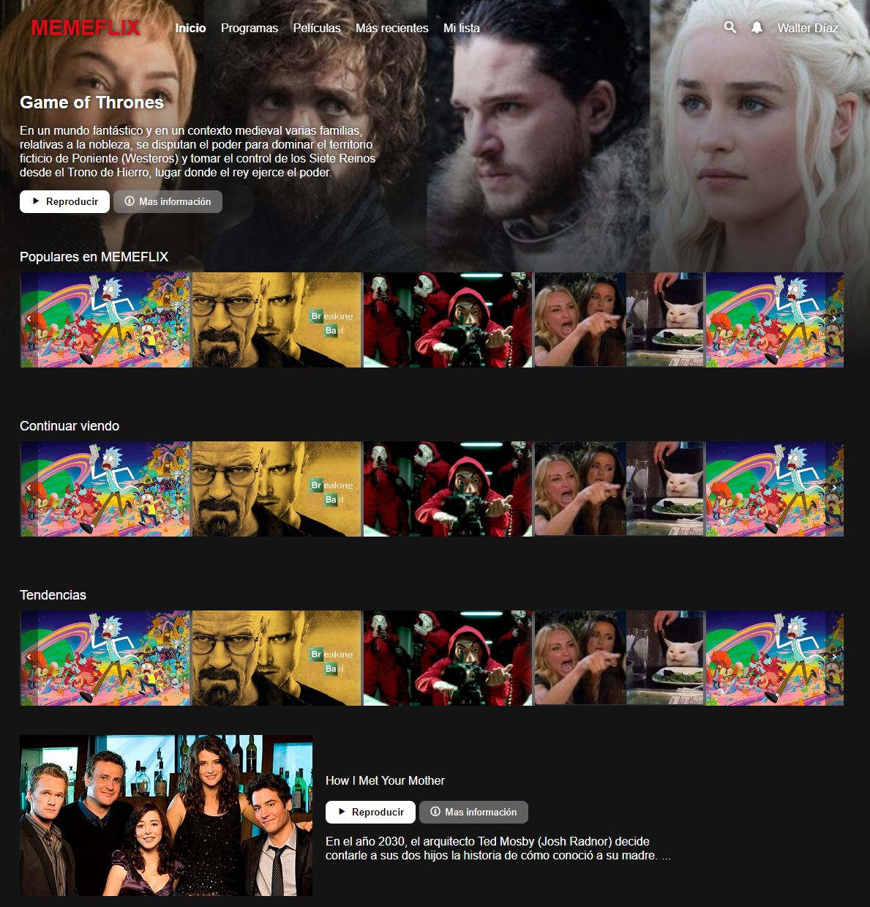
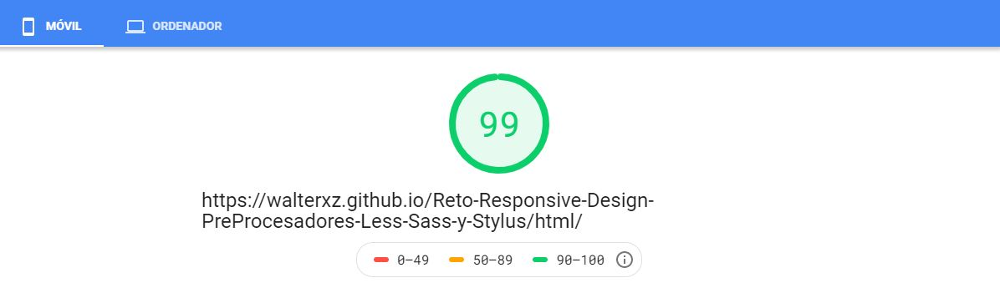

# Reto Preprocesadores

>Replica el portal responsive de Netflix.com, elabora la estructura utilizando PUG, para la definición de estilos debes utilizar Less, Sass y Stylus e implementa los recursos necesario para  que el código sea reutilizable y óptimo.

https://walterxz.github.io/Reto-ResponsiveDesign-Preprocesadores/html/

Previsualización

Se implementaron las técnicas aprendidas en el curso WPO Optimización de Carga de Sitios Web

* Minify Css
* Tiny Images

